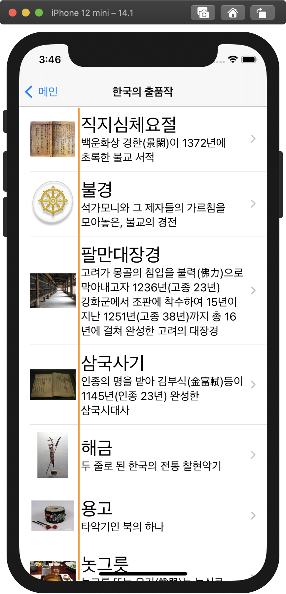
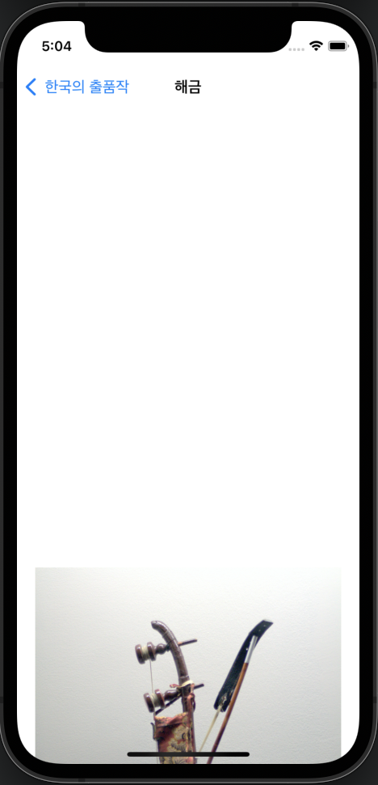

# README

# 그라운드룰

## 1. 시간 약속

- 스크럼 : 오전 10시
- 진행 시간 : 오전 10시 ~ 오후 10시
식사 시간 : 1시간 30분씩
- 수: 모일경우, 오후 2시 이후

## 2. 커밋

### 커밋 단위

메서드 단위로 함. 필요하면 다른 기준도 가능함.

## 3. 코딩 컨벤션

### 개행

- 아웃렛 변수는 한줄 띄움니다.
- 분기문, 조건문 앞에 한칸 띄움니다.

### 최대 줄 길이

한 줄은 최대 99자를 넘지 않아야 합니다.

# 핵심 개념

- UITableView
- UITableViewDataSource
- UITableViewDelegate
- UITableViewController
- JSON, JSONDecoder
- AssetCatalog 활용
- UINavigationController
- UIScrollView
- Dynamic Types
- Auto Layout
- Word Wrapping / Line Wrapping / Line Break 방식의 이해

---

# STEP1

[https://github.com/yagom-academy/ios-exposition-universelle/pull/111](https://github.com/yagom-academy/ios-exposition-universelle/pull/111)

## 고민했던 점, 리뷰

### 1. 파일 나누는 기준

`ExpositionInformation.swift`, `ExpositionSubmission.swift` 파일을 합칠지 나눌지 고민했습니다. 타입별로 나누었을 때, 파일을 찾고 관리하기가 쉽다고 판단했기 때문입니다.

❇️ **리뷰**

각 파일의 코드 양은 적고 비슷하다고는 하나, 하나의 파일에는 최대한 하나의 타입을 정의하는 것이 통상적이다. 

### 2. Assets.xcassets 내 폴더 생성

Asset Catalog내 파일들을  `Data` , `Images`폴더를 이용해서 파일 종류에 따라 분류했습니다. 폴더를 생성하면 각 파일에 접근하고 관리하기 용이한 장점이 있을거라 생각했습니다.

### 3. Codable이 아닌 Decodable을 채택한 이유

현재 프로젝트에서 클라이언트단(사용자 측)에서 데이터의 수정이 이루어 지지 않으며, 확장될 가능성도 적다고 판단하였습니다. 이에 애플리케이션에서 JSON 형식으로 변환할 이유가 없기때문에 Codable을 채택하지 않았습니다.

### 4. JSONDecoder 인스턴스를 변수로 만드는 게 좋은지

❇️ **리뷰** : 변수를 만듦으로서 특별한 이점은 없으나, 확장성에 있어서 유리한 경우가 존재합니다.
ex) keyDecodingStrategy 등의 옵션을 설정해 줄때

### 5. 구체적인 모델링

❇️  **리뷰** 

- ViewController에서 View를 생성 및 구현하는 작업에는 자원이 소모되기에 구체적인 모델링을 통해 방지가 가능합니다.

✅ **반영**

- ViewController의 @IBOutlet 변수에 UIImage와 String를 바로 사용할 수 있도록 연산프로퍼티를 구현해주었습니다.
    - 두 개의 레이블을 생성하는 것 보다 하나의 레이블을 생성하는 것이 효율적이라고 생각했습니다.
        - ex) `방문객 :` `...명`  vs  `방문객 : ...명`

### 6. JSON디코딩 해주는것도 모델로 빼서 모듈화 시켜보기

❇️ **리뷰**

현재 구현 스코프 정도에서는 따로 만들지 않아도 충분하긴 합니다.
다만 최대한 타입들과 기능들을 잘게 쪼개어 가져다 쓸 수 있도록 객체지향적으로 항상 바라보는 습관이 중요할것 같아 언지드렸습니다!
이 프로젝트 외에 현업에 가시면 모든걸 언제 확장되거나 쓰일지 몰라도 모듈화를 시키는 작업이 좋은 프로그래밍이라 생각합니다👍

```swift
import UIKit

enum JSONParser<Element: Decodable> {
    static func decode(from jsonFileName: String) -> Element? {
        guard let entriesData = NSDataAsset(name: jsonFileName) else {
            return nil
        }
        let data = try? JSONDecoder().decode(Element.self, from: entriesData.data)
        return data
    }
}
```

이렇게 하나의 공통 타입으로 뺀다면
호출부에서는 간략히

`JSONParser<[ExpositionEntry]>.decode(from: xxx)`

이런식으로 쓸 수 있을것 같아요.

✅ **반영**

JSONParser 열거형 타입을 정의하고, 전역적으로 접근할 수 있도록 타입메서드로 정의해주었습니다.

 **`static func**decode(from jsonFileName: String) -> Element?` 

반영 커밋: https://github.com/aCafela-coffee/ios-exposition-universelle/commit/714f595393ab1ce5e3bf2865a5576a338f86280b

---

# STEP2

[https://github.com/yagom-academy/ios-exposition-universelle/pull/121](https://github.com/yagom-academy/ios-exposition-universelle/pull/121)

## 고민한 점, 리뷰

### 1. UITableViewDataSource를 채택하는 객체를 별도로 생성할지에 대한 고민

- `UITableViewDataSource`를 채택하는 객체를 만들면 ViewController가 커지는 것을 방지할 수 있습니다. 예를 들어, 데이터를 업데이트하거나 페칭하는 코드를 별도의 정의된 클래스에서 구현해줌으로 뷰컨트롤러의 코드를 줄이고, 뷰에 관한 일만 하도록 집중시킬 수 있습니다.
- 이러한 장점에 따라 DataSource객체를 별도의 파일에 만들어 줄지 고민했습니다.

➡️  그런데 저희의 프로젝트 요구사항에서 데이터를 업데이트하고, 페칭하는 코드의 양이 많지 않을거라 판단해 TableViewController로 DataSource에 대한 처리를 구현해주었습니다.

[참고 문서](https://developer.apple.com/tutorials/app-dev-training/configuring-table-view-cells)

> Extract Data Source Methods
As your app grows, view controllers can become large and serve many 
purposes. In this section, pull the code related to fetching and 
updating data out of the view controller. Extracting the data source 
logic into its own class separates the concerns of these classes and 
focuses the view controller on view management.
> 

### 2. UITableView vs UITableViewController

- 한국 출품작의 리스트를 보여줄 때 UIViewController 위에 UITableView를 올릴지
- UITableViewController를 이용하여 table를 보여줄지
에 대한 고민을 했습니다.

❇️ **리뷰**: 현재 구조에서는 UITableVC로 사용하신 지금이 가장 딱 좋습니다.
왜냐면 테이블VC외에 커스텀한 구현이 없기에 UIVC으로 할 이유가 없다고 판단됩니다.

**UITableViewController의 장점**

- UITableViewController는 루트 뷰가 UITableView이고 다른 뷰(스택뷰 등...)를 추가할 수 없습니다.
- 따라서 UIViewController에서 TableView를 얹어주는 것보다 더 적은 view가 필요하므로 메모리가 적게 사용됩니다.
- 그리고 TableView에 오토레이아웃이 자동으로 적용되는 이점이 있습니다.

➡️  이번 프로젝트의 두번째 화면의 경우 TableView만 보여질 것이고, 따로 view가 추가될 확장성이 없다고 판단하여 TableViewController를 사용해서 tableView를 만들어주었습니다.

### 3. @IBOutlet var `weak` vs `strong`

@IBOutlet 변수의 참조 방식(`weak`, `strong`)의 차이에 대해 고민해보았습니다.

**Strong**

> 복잡한 view heirachy를 가진 경우 `weak`로 모든 connection을 주면어떤 view가 어느 이유인지 모르게 메모리에서 해제된다면 view의 subview도 해제됩니다. 따라서 `strong`으로 연결해주면 그런 상황을 방지할 수 있습니다
> 

**Weak**

> 메모리가 부족하면 ViewController의 `didReceiveMemoryWarning` 이 호출됩니다. 보통 `didReceiveMemoryWarning` 에서 main view를 nil 처리함으로써 main view를 포함한 subview들 까지 모두 dealloc 하여 메모리를 확보하는 동작을 구현합니다.
> 

➡️ 이번 프로젝트의 뷰는 비교적 간단한 뷰 계층구조를 가지고 있으니 디폴트로 `weak` 로 정의해줘도  괜찮다고 판단했습니다.

## 4. label vs textField vs textView의 차이

> REF: [Human Interface Guidelines](https://developer.apple.com/design/human-interface-guidelines/)
> 
> - label: A label describes an onscreen interface element or provides a short message.
> - textField: A text field is a single-line, fixed-height field that automatically brings up a keyboard when people tap it.
> - textView: A text view displays multiline, styled text content. Text views can be any height and enable scrolling when the content extends outside of the view.

## Q&A

### 1. 상수의 사용

```swift
let title = expositionEntries?[indexPath.row].name
let image = expositionEntries?[indexPath.row].image
let description = expositionEntries?[indexPath.row].description

entryDetailViewController.setData(image: image, description: description)
entryDetailViewController.navigationItem.title = title
```

> setData메서드에 인자와 네비게이션 타이틀에 바로 해당 값을 넣어주는것과
이렇게 상수를 만들어 해당 상수로 넣어주는것은 어떤 차이가 있을까요?🤔
> 

상수를 만들어서 넣어주는 방법

1. 상수로 따로 빼줌으로써 가독성이 향상됩니다.

매개변수에 바로 해당 값을 넣어주는 방법

1. 코드의 양이 줄어듭니다.
2. 매개변수의 출처가 명확해집니다.

추가적으로 두 방법은 메모리 사용량의 차이가 없을 것이라 생각했습니다.
근거는 스위프트의 String은 Copy On Write에 따라서 값이 변경되지 않는 이상 참조로 전달되고,
UIImage도 클래스이므로 참조로 전달됩니다. 따라서 각 상수가 참조로 사용되므로 복사 시 메모리 낭비의 문제는 없을 것입니다.

### 2. setNavigationBarHidden(_:animated:)

```swift
override func viewWillAppear(_ animated: Bool) {
    super.viewWillAppear(animated)
    navigationController?.setNavigationBarHidden(true, animated: animated)
}
```

> isNavigationBarHidden과 어떤 차이가 있나요?🤔
> 

isNavigationBarHidden은 애니메이션이 없어요. 화면이 완전히 전환되기 전에 네비게이션 바가 나타나요.


setNavigationBarHidden(true, animated: true)


isNavigationBarHidden = true

---

# STEP3

[https://github.com/yagom-academy/ios-exposition-universelle/pull/133](https://github.com/yagom-academy/ios-exposition-universelle/pull/133)

## 고민한 부분

### 첫번째 화면만 세로로 고정하기

```swift
class ExpositionInformationViewController: UIViewController {
    override var supportedInterfaceOrientations: UIInterfaceOrientationMask {
        return [.portrait]
    }
}
```

`ExpositionInformationViewController`에서 위 `supportedInterfaceOrientations` 프로퍼티를 수정했습니다.

그리고 위의 뷰 컨트롤러는 `UINavigationController`에 있기 때문에 아래 코드도 필요했습니다.

```swift
class ContainerViewController: UINavigationController {
    override var supportedInterfaceOrientations: UIInterfaceOrientationMask {
        return self.topViewController?.supportedInterfaceOrientations ?? [.all]
    }
}
```

### 첫 화면 레이블의 폰트크기에 대한 고민

- 요구사항 화면상에서는 `방문객` 과 해당 값의 폰트 사이즈가 상이합니다.
- 레이블 타이틀 역할을 하는 레이블을 생성할지에대해서 고민했지만, step1 피드백(view를 생성하면 뷰/뷰컨이 커진다)을 반영하여 하나의 레이블로 통일 후, `NSMutableAttributedString` 을 이용하여 구연하였습니다.

### EntriesTableView에서 셀의 이미지 레이아웃 크기 정하기

```swift
private func setCellConfiguration(from:, cellForRowAt:) -> UIListContentConfiguration {
    configuration.imageProperties.reservedLayoutSize.width = 50
    return configuration
}
```

셀의 글이 아래 화면의 주황선을 넘기지 않도록 수정했습니다.



### StackView내 ItemImageView의 제약



- 해금, 나전칠기 등 몇몇의 이미지가 위 사진과 같이 넓이는 꽉 채우면서 위아래로 공백을 만드는 이슈가 있었습니다.
- ItemImageView의 Content Hugging Priority를 높이는 방법으로 해결하려고 했으나, 여전히 공백을 만들어서
- `ItemImageView의 width : height 의 aspect ratio = 1:1` 제약을 추가해서 공백을 줄여주었습니다.
- 그런데 다른 출품작들에서는 네비게이션바와 이미지사이에 공백이 오히려 더 추가되는 것 같아, best practice는 아닌 것 같다는 생각이 들었습니다.
- 이와 관련해서 더 나은 수정 방향은 어떤게 있을까요??

## 해결하지 못한 부분

- Entry Detail View(세번째 화면) 가로 화면에서 스크롤바를 오른쪽 끝에 붙이기
- ExpositionInformationView 에서 National Flag의 Adjust Image Size 사용해서 크기 조절하기
- EntriesTableView에서 셀의 이미지 Adjust Image Size 사용해서 크기 조절하기